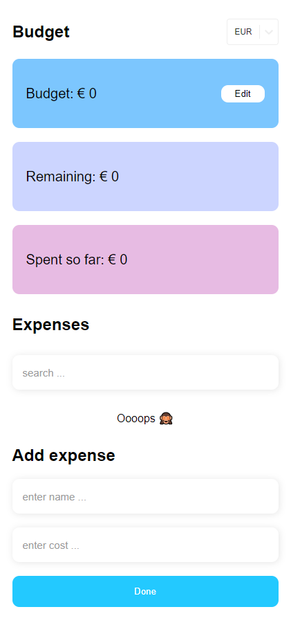
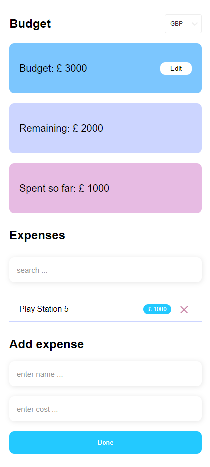

<!-- PROJECT LOGO -->
 

   <h3 align="center">React Budget App</h3>

  

    <a href="https://marshitsky.github.io/react-budget-app/" target="_blank">View Demo</a>
  

  
Table of Contents

  <ol>
    <li>
      <a href="#about-the-project">About The Project</a>
      <ul>
        <li><a href="#built-with">Built With</a></li>
      </ul>
    </li>
    <li><a href="#contact">Contact</a></li>
  </ol>

 

## About The Project

 

This little app will help you make a shopping list and plan your expenses.  
Simply enter your budget and make a list - the app will give you a total amount of purchases and notify you if you are overspending

<h3>Screenshots:</h3> 

<!--  -->

 

### Built With

 

- 
- 

### Tools used

 

- React-select
- Styled-components
- gh-pages
- uuid
- react-hook-form

 

## Contact

Miroslav - tg: [@MirMar](https://t.me/MirMar) | email: marshitsky@gmail.com

Project Link: [https://github.com/marshitsky/react-budget-app](https://github.com/marshitsky/react-budget-app)
